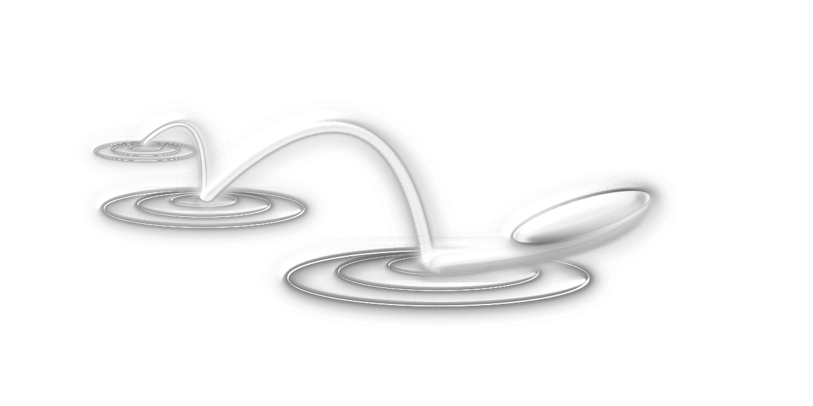

# Welcome to Shizen!

### A simple app for:

&#9775;   generating **courses** with **segments** and **elements**  

&#9775;   adding **participants** to your courses  

&#9775;   supply your participants with additional **content**  

&#9775;   get things done easier!  

Mizu Kiri (jap. 水切り "the art of cutting water") - stone skipping 

When skipping stones, you try to make the stone bounce as many times as possible on the surface but always in a playful way.  

You want to practice something and make a habit of it? Have fun and play! 

🚀✨ 

 
 

  
 
  
  

