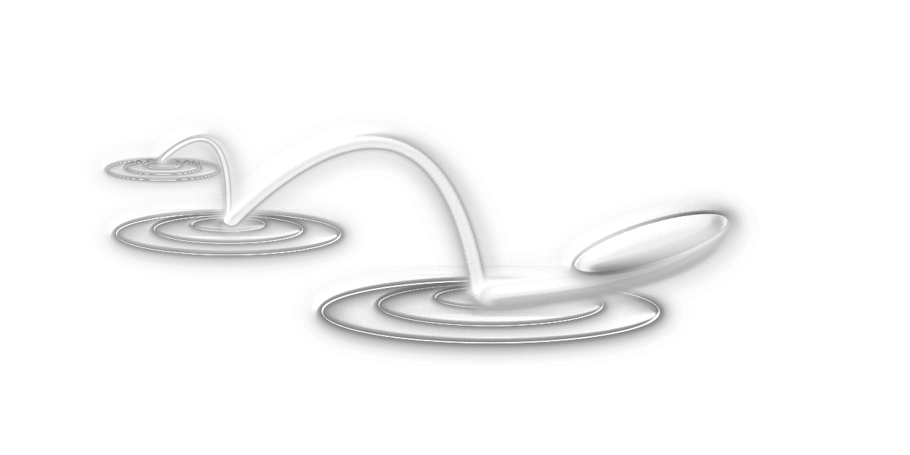

# Welcome to Ninjin!

## A simple app for teachers and instructors to generate courses and supply their participants with additional content.

### Mizu Kiri (jap. 水切り "the art of cutting water") is the main concept behind this app. 
## When skipping stones, you try to make the stone bounce as many times as possible on the surface, but always in a playful way.
## You want to practice something and make a habit of it? Have fun and play! 

